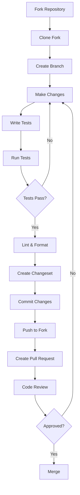
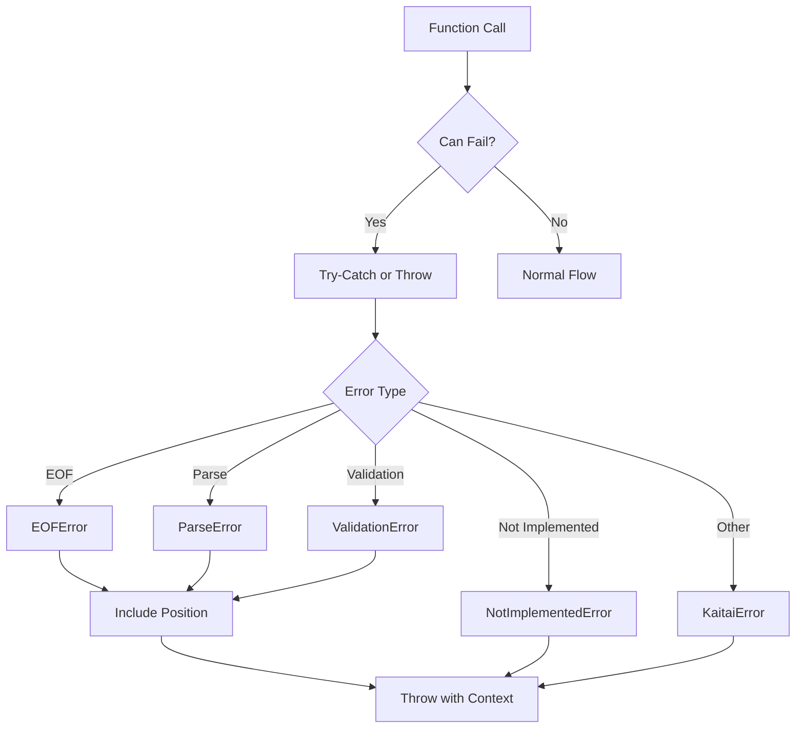
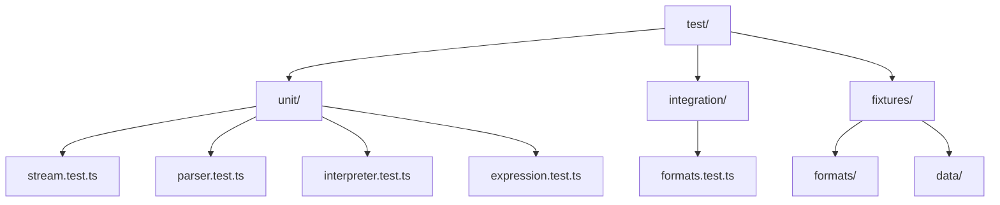
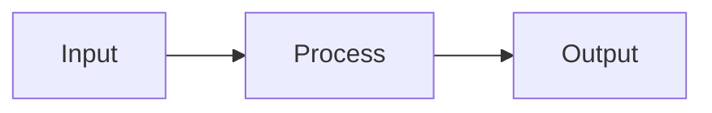
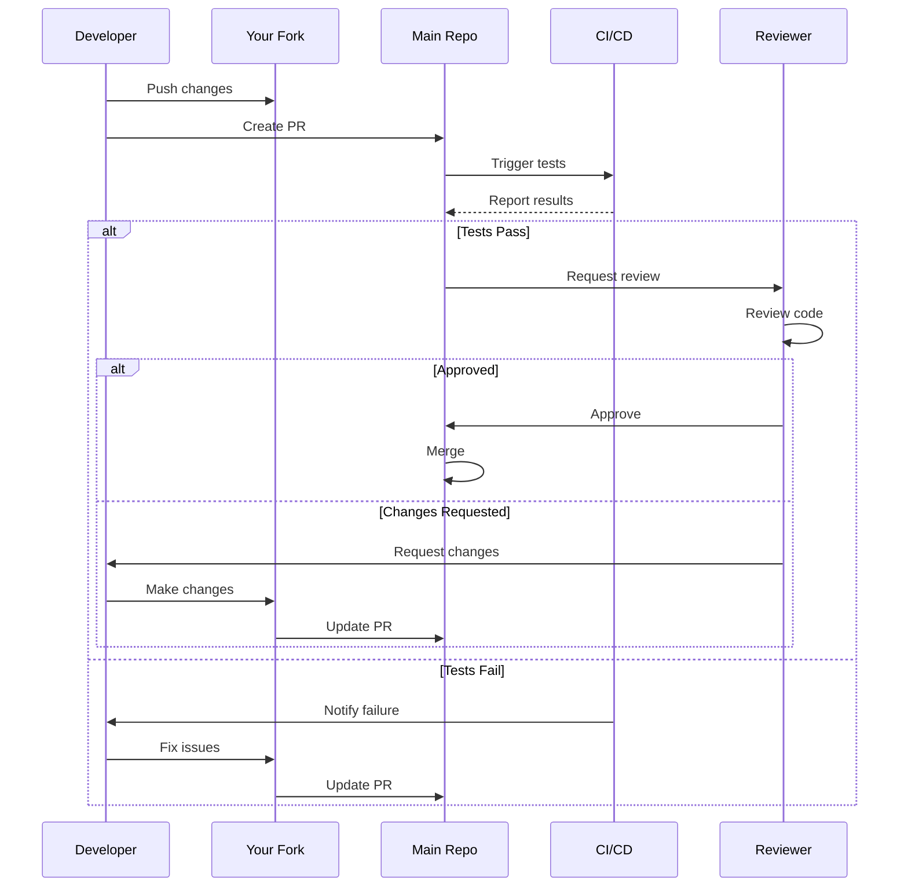
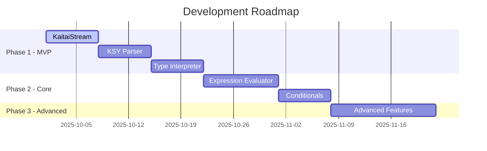

# Contributing to kaitai-struct-ts

Thank you for your interest in contributing to kaitai-struct-ts! This document provides guidelines and workflows for contributing to the project.

## Table of Contents

- [Code of Conduct](#code-of-conduct)
- [Getting Started](#getting-started)
- [Development Workflow](#development-workflow)
- [Coding Standards](#coding-standards)
- [Testing](#testing)
- [Documentation](#documentation)
- [Submitting Changes](#submitting-changes)

## Code of Conduct

This project follows a standard code of conduct. Please be respectful and constructive in all interactions.

## Getting Started

### Prerequisites

- Node.js 18 or higher
- pnpm 10 or higher

### Setup

1. Fork the repository
2. Clone your fork:

   ```bash
   git clone https://github.com/YOUR_USERNAME/kaitai-struct-ts.git
   cd kaitai-struct-ts
   ```

3. Install dependencies:

   ```bash
   pnpm install
   ```

4. Create a branch for your changes:
   ```bash
   git checkout -b feature/your-feature-name
   ```

## Development Workflow



### Available Scripts

```bash
# Development
pnpm dev              # Build in watch mode
pnpm build            # Build for production

# Testing
pnpm test             # Run tests
pnpm test:ui          # Run tests with UI
pnpm test:coverage    # Run tests with coverage

# Code Quality
pnpm lint             # Lint code
pnpm lint:fix         # Lint and fix
pnpm format           # Format code
pnpm format:check     # Check formatting
pnpm typecheck        # Type check

# Changesets
pnpm changeset        # Create a changeset
```

## Coding Standards

### TypeScript Guidelines

1. **Use strict TypeScript**
   - Enable all strict mode options
   - Avoid `any` types (use `unknown` if necessary)
   - Provide explicit return types for public functions

2. **File Headers**
   All source files must include a header:

   ```typescript
   /**
    * @fileoverview Brief description of the file
    * @module module/name
    * @author Your Name
    * @license MIT
    */
   ```

3. **JSDoc Comments**
   All public APIs must have complete JSDoc:

   ````typescript
   /**
    * Brief description of the function.
    * More detailed explanation if needed.
    *
    * @param paramName - Description of parameter
    * @returns Description of return value
    * @throws {ErrorType} Description of when error is thrown
    * @example
    * ```typescript
    * const result = myFunction(42)
    * ```
    */
   export function myFunction(paramName: number): string {
     // implementation
   }
   ````

4. **Naming Conventions**
   - Classes: `PascalCase`
   - Functions/Methods: `camelCase`
   - Constants: `UPPER_SNAKE_CASE`
   - Private members: prefix with `_`
   - Interfaces: `PascalCase` (no `I` prefix)
   - Type aliases: `PascalCase`

### Code Style

- Use Prettier for formatting (automatic)
- Use ESLint for linting (automatic)
- Maximum line length: 80 characters
- Use single quotes for strings
- No semicolons
- Trailing commas in multi-line structures

### Error Handling



Always use appropriate error types and include context (position, etc.).

## Testing

### Test Structure



### Writing Tests

1. **Unit Tests**
   - Test individual functions/classes in isolation
   - Mock dependencies
   - Cover edge cases
   - Use descriptive test names

   ```typescript
   describe("KaitaiStream", () => {
     describe("readU1", () => {
       it("should read single byte correctly", () => {
         const stream = new KaitaiStream(new Uint8Array([0x42]));
         expect(stream.readU1()).toBe(0x42);
       });

       it("should throw EOFError when reading past end", () => {
         const stream = new KaitaiStream(new Uint8Array([]));
         expect(() => stream.readU1()).toThrow(EOFError);
       });
     });
   });
   ```

2. **Integration Tests**
   - Test complete parsing workflows
   - Use real .ksy files and binary data
   - Verify output correctness

3. **Coverage Goals**
   - Minimum 80% overall coverage
   - 100% coverage for critical paths
   - All error paths tested

## Documentation

### Code Documentation

1. **JSDoc for all public APIs**
   - Include description, parameters, return values, exceptions
   - Provide examples
   - Link to related functions/classes

2. **Inline Comments**
   - Explain "why", not "what"
   - Document complex algorithms
   - Note any non-obvious behavior

### Markdown Documentation

1. **Use Mermaid diagrams** for:
   - Architecture diagrams
   - Flow charts
   - Sequence diagrams
   - State diagrams
   - Gantt charts

2. **Structure**
   - Clear headings
   - Table of contents for long documents
   - Code examples with syntax highlighting
   - Links to related documentation

### Example Documentation Structure

````markdown
# Feature Name

## Overview

Brief description with a diagram:



## Usage

```typescript
// Example code
```

## API Reference

### functionName

Description...

**Parameters:**

- `param1` - Description

**Returns:** Description

**Example:**

```typescript
const result = functionName(param1);
```
````

## Submitting Changes

### Commit Messages

Follow conventional commits format:

```
type(scope): subject

body

footer
```

**Types:**

- `feat`: New feature
- `fix`: Bug fix
- `docs`: Documentation changes
- `style`: Code style changes (formatting, etc.)
- `refactor`: Code refactoring
- `test`: Adding or updating tests
- `chore`: Maintenance tasks

**Examples:**

```
feat(stream): add support for bit-level reading

Implement readBitsIntBe and readBitsIntLe methods for reading
arbitrary number of bits from the stream.

Closes #123
```

```
fix(parser): handle empty sequences correctly

Previously, empty seq arrays would cause a parsing error.
Now they are handled gracefully.
```

### Creating a Changeset

Before submitting a PR, create a changeset:

```bash
pnpm changeset
```

Follow the prompts to:

1. Select the type of change (major, minor, patch)
2. Provide a summary of changes

This will create a file in `.changeset/` that will be used to generate the changelog.

### Pull Request Process



1. **Create Pull Request**
   - Use a descriptive title
   - Reference related issues
   - Describe changes in detail
   - Include screenshots/examples if applicable

2. **PR Template**

   ```markdown
   ## Description

   Brief description of changes

   ## Type of Change

   - [ ] Bug fix
   - [ ] New feature
   - [ ] Breaking change
   - [ ] Documentation update

   ## Testing

   - [ ] Unit tests added/updated
   - [ ] Integration tests added/updated
   - [ ] All tests passing

   ## Checklist

   - [ ] Code follows style guidelines
   - [ ] Self-review completed
   - [ ] Comments added for complex code
   - [ ] Documentation updated
   - [ ] Changeset created
   - [ ] No breaking changes (or documented)
   ```

3. **Review Process**
   - Address all review comments
   - Keep discussions focused and constructive
   - Update PR based on feedback
   - Request re-review when ready

4. **Merging**
   - Squash commits if requested
   - Ensure CI passes
   - Wait for maintainer approval
   - Maintainer will merge

## Development Phases

We're currently in **Phase 1 (MVP)**. Contributions should align with the current phase:



See [PROJECT_DESIGN.md](./PROJECT_DESIGN.md) for detailed phase information.

## Questions?

- Check [PROJECT_DESIGN.md](./PROJECT_DESIGN.md) for architecture details
- Check [ARCHITECTURE.md](./docs/ARCHITECTURE.md) for diagrams
- Open an issue for questions
- Join discussions in existing issues

## License

By contributing, you agree that your contributions will be licensed under the MIT License.
