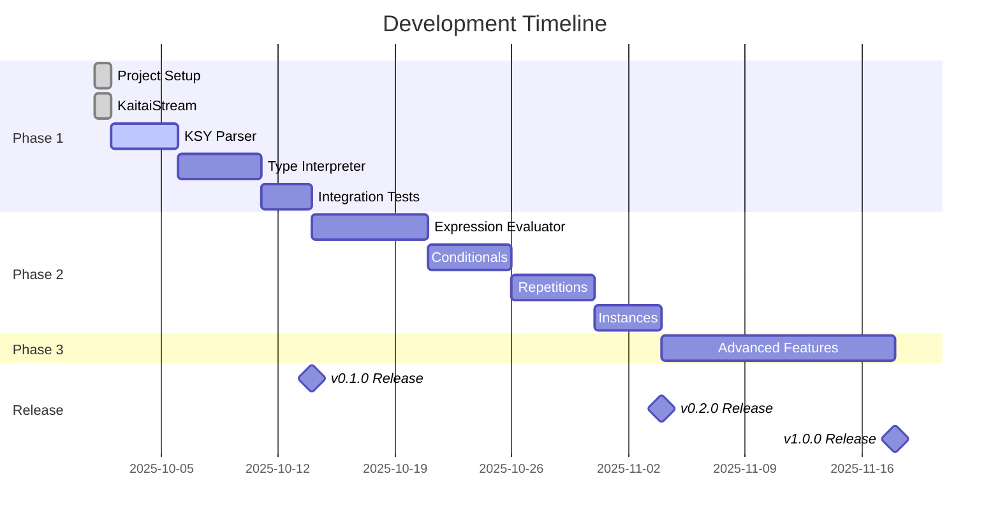

# Project Progress

**Last Updated:** 2025-10-01  
**Current Phase:** Phase 1 - MVP (In Progress)  
**Overall Completion:** ~25%

## Summary

This document tracks the progress of the kaitai-struct-ts project, a runtime interpreter for Kaitai Struct binary format definitions in TypeScript.

## Completed Work

### ✅ Project Setup & Infrastructure

- [x] **Package Management**
  - Initialized with pnpm 10.16.1
  - Configured package.json with proper exports and scripts
  - Set up dependency management

- [x] **Build Tooling**
  - Configured tsup for building (ESM + CJS)
  - Set up TypeScript 5.9.3 with strict mode
  - Configured source maps and declaration files

- [x] **Testing Framework**
  - Integrated vitest for unit testing
  - Added @vitest/ui for test visualization
  - Configured @vitest/coverage-v8 for coverage reports
  - Target: 80%+ coverage

- [x] **Code Quality Tools**
  - ESLint with TypeScript plugin
  - Prettier for code formatting
  - Configured eslint-config-prettier for compatibility

- [x] **Version Management**
  - Integrated @changesets/cli
  - Created initial changeset
  - Configured for public npm publishing

### ✅ Core Implementation

- [x] **KaitaiStream Class** (`src/stream/KaitaiStream.ts`)
  - Complete binary stream reader implementation
  - **Unsigned integers:** u1, u2le, u2be, u4le, u4be, u8le, u8be
  - **Signed integers:** s1, s2le, s2be, s4le, s4be, s8le, s8be
  - **Floating point:** f4le, f4be, f8le, f8be
  - **Byte arrays:** fixed length, until terminator, all remaining
  - **Strings:** with encoding support (UTF-8, ASCII, Latin-1, UTF-16LE/BE)
  - **Bit-level reading:** readBitsIntBe, readBitsIntLe
  - **Position management:** seek, pos, isEof
  - **Substreams:** create isolated stream views
  - Full JSDoc documentation with examples

- [x] **Error Handling** (`src/utils/errors.ts`)
  - `KaitaiError` - Base error class
  - `EOFError` - End of stream errors
  - `ParseError` - Parsing errors
  - `ValidationError` - Validation errors
  - `NotImplementedError` - Feature not yet implemented
  - All errors include position information

- [x] **String Encoding** (`src/utils/encoding.ts`)
  - UTF-8 encoding/decoding with fallback
  - ASCII encoding
  - Latin-1 (ISO-8859-1) encoding
  - UTF-16 Little Endian
  - UTF-16 Big Endian
  - TextDecoder fallback for other encodings

### ✅ Testing

- [x] **KaitaiStream Tests** (`test/unit/stream.test.ts`)
  - 100+ test cases covering all functionality
  - Constructor and basic properties
  - Position management
  - All integer types (signed/unsigned, all sizes, both endianness)
  - Floating point numbers
  - Byte array operations
  - String operations
  - Bit-level reading
  - Error handling
  - Utility methods

### ✅ Documentation

- [x] **README.md**
  - Project overview and features
  - Installation instructions
  - Quick start guide
  - Current status
  - API documentation
  - Development guide
  - Roadmap

- [x] **PROJECT_DESIGN.md**
  - Comprehensive design document
  - Goals and requirements
  - Technical approach
  - Architecture overview
  - Component specifications
  - Development phases
  - Testing strategy
  - Release strategy
  - Decision log

- [x] **ARCHITECTURE.md** (`docs/ARCHITECTURE.md`)
  - High-level architecture with Mermaid diagrams
  - Component relationships
  - Data flow diagrams
  - Module structure
  - Type system diagrams
  - State management
  - Error handling flow
  - Phase implementation roadmap
  - Performance considerations
  - Testing strategy

- [x] **CONTRIBUTING.md**
  - Code of conduct
  - Getting started guide
  - Development workflow with Mermaid diagrams
  - Coding standards
  - JSDoc requirements
  - Testing guidelines
  - Documentation standards
  - Pull request process
  - Commit message conventions

- [x] **LICENSE** - MIT License

- [x] **CHANGELOG.md** - Initialized

- [x] **Complete JSDoc**
  - File headers for all source files
  - Complete API documentation
  - Examples for all public methods
  - Parameter and return type documentation

## Current Work

### 🔄 Phase 1 - MVP (In Progress)

Next steps:

1. Implement KSY YAML parser
2. Implement basic type interpreter
3. Add integration tests
4. Complete Phase 1 documentation

## Pending Work

### 📋 Phase 1 - MVP (Remaining)

- [ ] **KSY Parser** (`src/parser/`)
  - Parse YAML .ksy files
  - Validate schema structure
  - Build internal AST representation
  - Handle meta section
  - Handle seq section
  - Handle basic types

- [ ] **Type Interpreter** (`src/interpreter/`)
  - Execute schema against binary data
  - Handle sequential field reading
  - Handle nested types
  - Build result objects
  - Context management (\_root, \_parent, \_io)

- [ ] **Integration Tests**
  - Test with simple custom formats
  - Verify end-to-end parsing
  - Test error scenarios

### 📋 Phase 2 - Core Features

- [ ] **Expression Evaluator** (`src/expression/`)
  - Lexer for tokenization
  - Parser for AST generation
  - Evaluator for execution
  - Support all operators
  - Field references

- [ ] **Conditionals**
  - if conditions
  - Enums
  - Switch/case

- [ ] **Repetitions**
  - repeat: expr
  - repeat: eos
  - repeat: until

- [ ] **Instances**
  - Lazy evaluation
  - pos positioning
  - value instances

### 📋 Phase 3 - Advanced Features

- [ ] Substreams and processing
- [ ] Bit-sized integers (advanced)
- [ ] Parametric types
- [ ] Type casting
- [ ] Imports
- [ ] Performance optimizations

### 📋 Publishing & Deployment

- [ ] GitHub repository setup
- [ ] CI/CD pipeline (GitHub Actions)
- [ ] NPM publishing workflow
- [ ] Documentation website
- [ ] Example projects

## Metrics

### Code Statistics

```
Source Files: 8
Test Files: 1
Total Lines: ~1,500
Test Coverage: TBD (targeting 80%+)
```

### File Structure

```
kaitai-struct-ts/
├── src/
│   ├── stream/          ✅ Complete
│   ├── parser/          ⏳ Pending
│   ├── interpreter/     ⏳ Pending
│   ├── expression/      ⏳ Pending
│   ├── types/           ⏳ Pending
│   └── utils/           ✅ Complete
├── test/
│   ├── unit/            🔄 In Progress
│   ├── integration/     ⏳ Pending
│   └── fixtures/        ⏳ Pending
├── docs/                ✅ Complete
└── examples/            ⏳ Pending
```

## Timeline



## Next Steps

### Immediate (This Week)

1. **Implement KSY Parser**
   - Create schema type definitions
   - Implement YAML parsing
   - Add validation logic
   - Write unit tests

2. **Start Type Interpreter**
   - Design interpreter architecture
   - Implement basic type reading
   - Handle sequential fields

### Short Term (Next 2 Weeks)

1. Complete Phase 1 MVP
2. Create example projects
3. Write integration tests
4. Publish v0.1.0

### Medium Term (Next Month)

1. Implement Phase 2 features
2. Expand test coverage
3. Performance optimization
4. Publish v0.2.0

## Notes

- All source files have complete JSDoc documentation
- Using Mermaid diagrams for all architecture documentation
- Following strict TypeScript best practices
- Maintaining high test coverage (80%+ target)
- Using changesets for version management
- Ready for GitHub repository creation
- Ready for npm publishing (after Phase 1 completion)

## Resources

- [Kaitai Struct Documentation](https://doc.kaitai.io/)
- [Kaitai Struct User Guide](https://doc.kaitai.io/user_guide.html)
- [Format Gallery](https://formats.kaitai.io/)
- [Project Design Document](./PROJECT_DESIGN.md)
- [Architecture Documentation](./docs/ARCHITECTURE.md)
- [Contributing Guide](./CONTRIBUTING.md)
