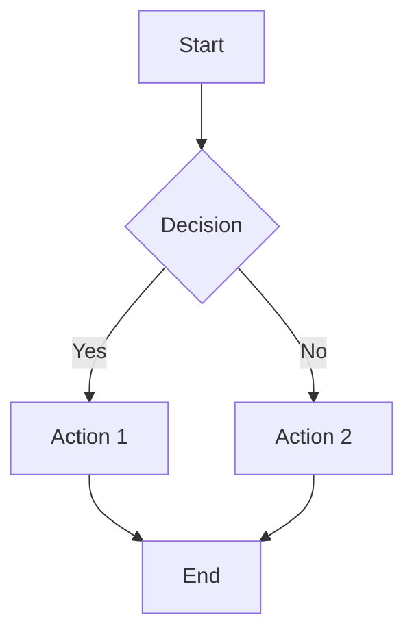
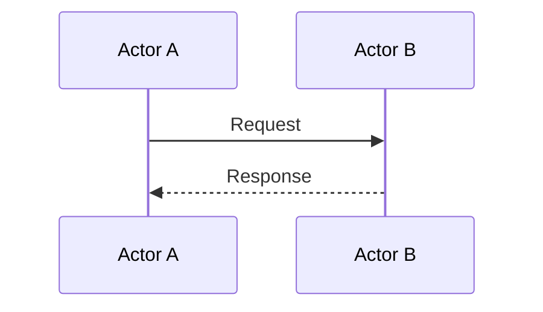
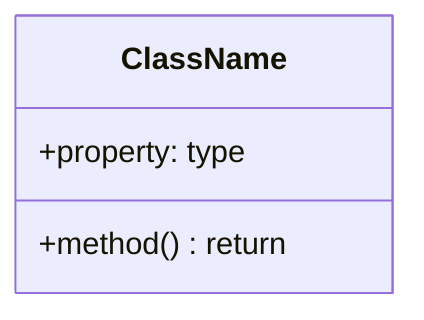

# Quick Reference Guide

## 🚀 Getting Started

```bash
# Install dependencies
pnpm install

# Build the project
pnpm build

# Run tests
pnpm test

# Run tests with UI
pnpm test:ui

# Check coverage
pnpm test:coverage

# Lint code
pnpm lint

# Format code
pnpm format
```

## 📁 Project Structure

```
src/
├── stream/          ✅ Binary stream reader
├── parser/          ✅ KSY YAML parser
├── interpreter/     ✅ Type interpreter
├── expression/      ✅ Expression evaluator
├── cli.ts           ✅ CLI utility
└── utils/           ✅ Errors & encoding

test/
├── unit/            ✅ Unit tests (100+ tests)
├── integration/     ✅ Integration tests
├── cli.test.ts      ✅ CLI tests (15 tests)
└── fixtures/        ✅ Test data

docs/
├── ARCHITECTURE.md  ✅ Architecture diagrams
├── CLI.md           ✅ CLI documentation
├── README.md        ✅ Documentation index
├── cli/             ✅ CLI-specific docs
└── development/     ✅ Development docs
```

## 🔧 Available Commands

| Command                  | Description                 |
| ------------------------ | --------------------------- |
| `pnpm build`             | Build for production        |
| `pnpm dev`               | Build in watch mode         |
| `pnpm test`              | Run tests                   |
| `pnpm test:ui`           | Run tests with UI           |
| `pnpm test:coverage`     | Generate coverage report    |
| `pnpm lint`              | Lint code                   |
| `pnpm lint:fix`          | Lint and auto-fix           |
| `pnpm format`            | Format code                 |
| `pnpm format:check`      | Check formatting            |
| `pnpm typecheck`         | Type check without building |
| `pnpm changeset`         | Create a changeset          |
| `pnpm changeset:version` | Update versions             |
| `pnpm changeset:publish` | Publish to npm              |

## 📚 Documentation Files

| File                                 | Purpose                            |
| ------------------------------------ | ---------------------------------- |
| `README.md`                          | Project overview and quick start   |
| `CHANGELOG.md`                       | Version history and release notes  |
| `CONTRIBUTING.md`                    | Development guidelines             |
| `EXAMPLES.md`                        | Format examples and usage patterns |
| `QUICKREF.md`                        | This file - quick reference        |
| `docs/CLI.md`                        | Complete CLI documentation         |
| `docs/ARCHITECTURE.md`               | Architecture with Mermaid diagrams |
| `docs/development/PROJECT_DESIGN.md` | Complete design specification      |
| `docs/development/PROGRESS.md`       | Detailed progress tracking         |
| `docs/README.md`                     | Documentation index                |

## 🎯 Current Status

**Version:** 0.7.0
**Status:** Production Ready 🚀
**Completion:** ~95% toward v1.0.0

### ✅ Completed

- ✅ Core Runtime (KaitaiStream, all primitive types)
- ✅ KSY Parser (full YAML parser with validation)
- ✅ Type Interpreter (execute schemas)
- ✅ Expression Evaluator (complete Kaitai expression language)
- ✅ Advanced Features (conditionals, enums, repetitions, instances, switch/case)
- ✅ CLI Tool (command-line utility)
- ✅ Testing (100+ comprehensive tests)
- ✅ Documentation (complete user and developer docs)

### ⏳ Remaining for v1.0.0

- Processing implementations (zlib, encryption)
- Type imports across files
- Additional performance optimizations

## 🔑 Key Classes

### KaitaiStream

```typescript
import { KaitaiStream } from "kaitai-struct-ts";

const buffer = new Uint8Array([0x01, 0x02, 0x03, 0x04]);
const stream = new KaitaiStream(buffer);

// Read integers
const byte = stream.readU1(); // 1 byte unsigned
const word = stream.readU2le(); // 2 bytes little-endian
const dword = stream.readU4be(); // 4 bytes big-endian

// Read strings
const str = stream.readStr(10, "UTF-8");
const strz = stream.readStrz("UTF-8");

// Read bytes
const bytes = stream.readBytes(5);
const allBytes = stream.readBytesFull();

// Position management
stream.seek(100);
const pos = stream.pos;
const eof = stream.isEof();
```

### Error Classes

```typescript
import {
  KaitaiError,
  EOFError,
  ParseError,
  ValidationError,
  NotImplementedError,
} from "kaitai-struct-ts";

try {
  stream.readU4le();
} catch (e) {
  if (e instanceof EOFError) {
    console.log("Reached end of stream at:", e.position);
  }
}
```

## 📝 Coding Standards

### File Header Template

```typescript
/**
 * @fileoverview Brief description
 * @module module/name
 * @author Fabiano Pinto
 * @license MIT
 */
```

### Function Documentation Template

````typescript
/**
 * Brief description.
 * Detailed explanation if needed.
 *
 * @param paramName - Parameter description
 * @returns Return value description
 * @throws {ErrorType} When error occurs
 * @example
 * ```typescript
 * const result = myFunction(42)
 * ```
 */
export function myFunction(paramName: number): string {
  // implementation
}
````

### Class Documentation Template

````typescript
/**
 * Brief class description.
 * More details about the class.
 *
 * @class ClassName
 * @example
 * ```typescript
 * const instance = new ClassName()
 * instance.method()
 * ```
 */
export class ClassName {
  /**
   * Property description
   */
  public property: string;

  /**
   * Constructor description
   * @param param - Parameter description
   */
  constructor(param: string) {
    this.property = param;
  }

  /**
   * Method description
   * @returns Return description
   */
  public method(): string {
    return this.property;
  }
}
````

## 🧪 Testing Patterns

### Unit Test Template

```typescript
import { describe, it, expect, beforeEach } from "vitest";

describe("ComponentName", () => {
  describe("methodName", () => {
    it("should do something correctly", () => {
      // Arrange
      const input = createInput();

      // Act
      const result = component.method(input);

      // Assert
      expect(result).toBe(expected);
    });

    it("should throw error on invalid input", () => {
      expect(() => component.method(invalid)).toThrow(ErrorType);
    });
  });
});
```

## 🎨 Mermaid Diagram Examples

### Flowchart

````markdown

````

### Sequence Diagram

````markdown

````

### Class Diagram

````markdown

````

## 🔄 Git Workflow

### Commit Message Format

```
type(scope): subject

body

footer
```

**Types:** feat, fix, docs, style, refactor, test, chore

**Example:**

```
feat(stream): add bit-level reading support

Implement readBitsIntBe and readBitsIntLe methods.

Closes #123
```

### Creating a Changeset

```bash
pnpm changeset

# Follow prompts:
# 1. Select change type (major/minor/patch)
# 2. Write summary
# 3. Commit the generated file
```

## 📦 Publishing Workflow

```bash
# 1. Create changeset
pnpm changeset

# 2. Commit changeset
git add .changeset/
git commit -m "chore: add changeset"

# 3. Version packages (updates package.json and CHANGELOG)
pnpm changeset:version

# 4. Commit version changes
git add .
git commit -m "chore: version packages"

# 5. Build and test
pnpm build
pnpm test

# 6. Publish to npm
pnpm changeset:publish

# 7. Push tags
git push --follow-tags
```

## 🐛 Debugging Tips

### Run Single Test

```bash
pnpm test stream.test.ts
```

### Run Test in Watch Mode

```bash
pnpm test --watch
```

### Debug with UI

```bash
pnpm test:ui
```

### Check Types

```bash
pnpm typecheck
```

### View Coverage

```bash
pnpm test:coverage
# Open coverage/index.html
```

## 🔗 Useful Links

- [TypeScript Handbook](https://www.typescriptlang.org/docs/)
- [Vitest Documentation](https://vitest.dev/)
- [tsup Documentation](https://tsup.egoist.dev/)
- [Changesets Documentation](https://github.com/changesets/changesets)
- [Kaitai Struct Docs](https://doc.kaitai.io/)
- [Mermaid Documentation](https://mermaid.js.org/)

## 💡 Tips

1. **Always run tests before committing**

   ```bash
   pnpm test && git commit
   ```

2. **Use watch mode during development**

   ```bash
   pnpm dev  # Build in watch mode
   pnpm test --watch  # Tests in watch mode
   ```

3. **Check formatting before PR**

   ```bash
   pnpm format:check
   pnpm lint
   ```

4. **Create changeset for every PR**

   ```bash
   pnpm changeset
   ```

5. **Keep documentation updated**
   - Update JSDoc when changing APIs
   - Update diagrams when changing architecture
   - Update PROGRESS.md when completing tasks

## 🎯 Release Checklist

### Phase 1-4 (v0.1.0 - v0.7.0) ✅ Complete

- [x] Project setup and infrastructure
- [x] KaitaiStream implementation
- [x] Error classes and string encoding
- [x] KSY parser with validation
- [x] Type interpreter
- [x] Expression evaluator
- [x] Advanced features (enums, conditionals, instances, switch/case)
- [x] CLI utility
- [x] Comprehensive testing (100+ tests)
- [x] Complete documentation

### Phase 5 (v1.0.0) 🔄 In Progress

- [ ] Processing implementations (zlib, encryption)
- [ ] Type imports across files
- [ ] Extended format testing
- [ ] Performance optimizations
- [ ] v1.0.0 release

## 📞 Need Help?

1. Check `README.md` for project overview
2. Check `docs/CLI.md` for CLI usage
3. Check `docs/ARCHITECTURE.md` for architecture diagrams
4. Check `docs/development/PROJECT_DESIGN.md` for design details
5. Check `CONTRIBUTING.md` for development guidelines
6. Check `EXAMPLES.md` for format examples
7. Check existing tests for code examples
8. Open an issue on [GitHub](https://github.com/fabianopinto/kaitai-struct-ts/issues)

## 🚀 Quick Start

### Library Usage

```typescript
import { parse } from "@k67/kaitai-struct-ts";

const ksyDefinition = `
meta:
  id: my_format
  endian: le
seq:
  - id: magic
    type: u4
  - id: version
    type: u2
`;

const binaryData = new Uint8Array([0x4d, 0x59, 0x46, 0x4d, 0x01, 0x00]);
const result = parse(ksyDefinition, binaryData);
console.log(result.version); // 1
```

### CLI Usage

```bash
# Parse binary file
kaitai format.ksy data.bin

# Save to file
kaitai format.ksy data.bin -o output.json

# Extract field
kaitai format.ksy data.bin --field version --quiet

# Get help
kaitai --help
```

---

**Last Updated:** 2025-10-02
**Version:** 0.7.0
