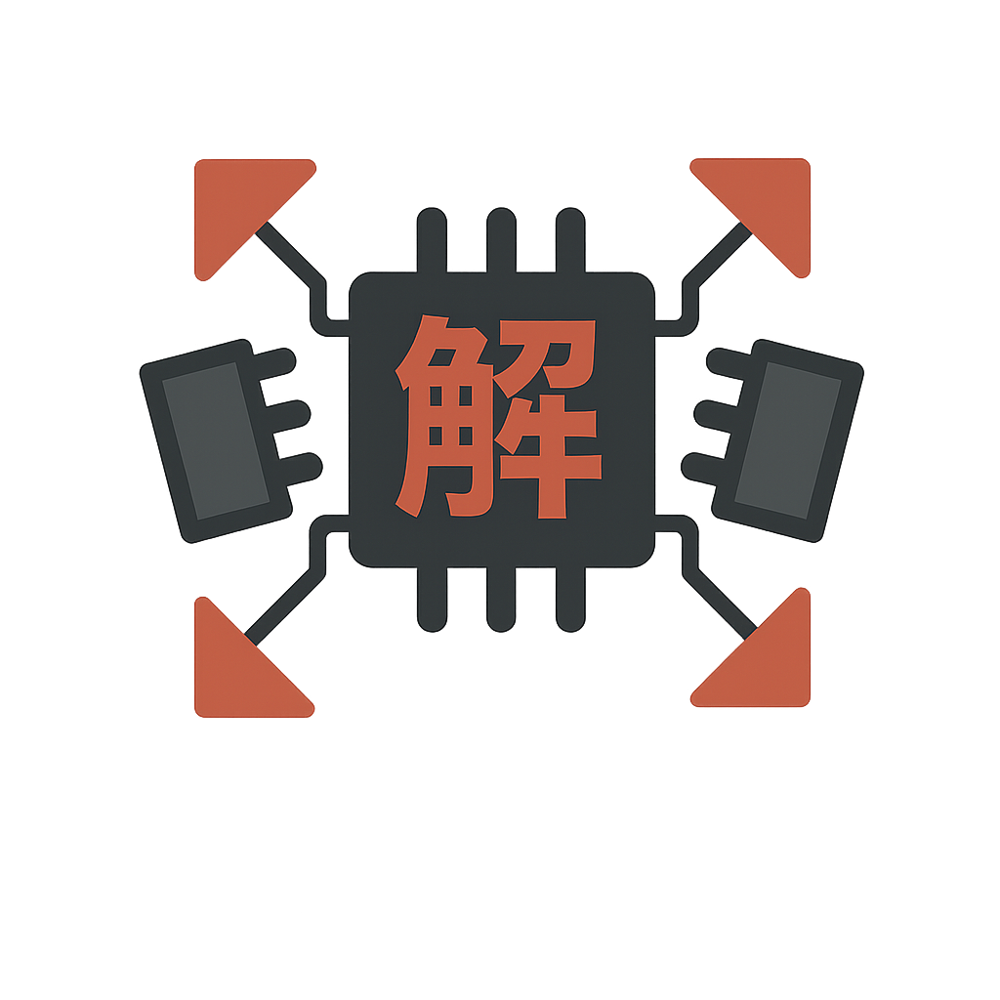

<div align="center">
  

# kaitai-struct-ts

[](https://www.npmjs.com/package/@k67/kaitai-struct-ts)
[](https://github.com/fabianopinto/kaitai-struct-ts/actions)
[](https://opensource.org/licenses/MIT)
[](https://www.typescriptlang.org/)
[](https://nodejs.org/)

**A runtime interpreter for [Kaitai Struct](https://kaitai.io/) binary format definitions in TypeScript.**

</div>

---

Parse any binary data format by providing a `.ksy` (Kaitai Struct YAML) definition file - no compilation step required!

## Features

### Core Features

- 🚀 **Runtime interpretation** - No code generation needed
- 📦 **Zero dependencies** (runtime) - Only YAML parser for development
- 🎯 **TypeScript native** - Full type safety and IntelliSense support
- 🌐 **Universal** - Works in Node.js and browsers
- 🧪 **Well tested** - 98 comprehensive tests
- 📖 **Well documented** - Clear API and examples

### Advanced Features

- ⚡ **Expression evaluation** - Full support for Kaitai expressions
- 🔀 **Switch/case types** - Dynamic type selection based on data
- 💎 **Instances** - Lazy-evaluated fields with caching
- 🎨 **Enums** - Named constants with expression access
- 🔁 **Conditional parsing** - if, repeat-expr, repeat-until
- 📍 **Positioned reads** - Absolute positioning with pos attribute

## Installation

```bash
npm install @k67/kaitai-struct-ts
# or
pnpm add @k67/kaitai-struct-ts
# or
yarn add @k67/kaitai-struct-ts
```

## Quick Start

```typescript
import { parse, KaitaiStream } from "@k67/kaitai-struct-ts";
import { readFileSync } from "fs";

// Load your .ksy definition
const ksyDefinition = `
meta:
  id: my_format
  endian: le
seq:
  - id: magic
    contents: [0x4D, 0x59, 0x46, 0x4D]
  - id: version
    type: u2
  - id: name
    type: str
    size: 32
    encoding: UTF-8
`;

// Load your binary data
const binaryData = readFileSync("data.bin");

// Parse!
const result = await parse(ksyDefinition, binaryData);

console.log(result.version); // Access parsed fields
console.log(result.name);
```

## Current Status

**Phase 2 (Core Features) - In Progress**

### Completed

- [x] Project setup and configuration
- [x] KaitaiStream implementation (all primitive types)
- [x] KSY parser with validation
- [x] Type interpreter (basic parsing)
- [x] Support for fixed-size structures
- [x] Nested user-defined types
- [x] Repetitions (expr, eos)
- [x] Contents validation
- [x] Comprehensive tests (58 tests passing)

### In Progress

- [ ] Expression evaluator
- [ ] Conditionals (if)
- [ ] Enums
- [ ] repeat-until

See [PROJECT_DESIGN.md](./PROJECT_DESIGN.md) for detailed roadmap and [ARCHITECTURE.md](./docs/ARCHITECTURE.md) for architecture diagrams.

## API Documentation

### `parse(ksy: string, buffer: ArrayBuffer | Uint8Array, options?: ParseOptions): Record<string, unknown>`

Parse binary data using a Kaitai Struct definition.

**Parameters:**

- `ksy` - YAML string containing the .ksy definition
- `buffer` - Binary data to parse
- `options` - Optional parsing options (validate, strict)

**Returns:** Parsed object with fields defined in the .ksy file

**Example:**

```typescript
import { parse } from "kaitai-struct-ts";

const result = parse(ksyYaml, binaryData, { validate: true });
console.log(result.fieldName);
```

### `KaitaiStream`

Low-level binary stream reader.

```typescript
const stream = new KaitaiStream(buffer);
const value = stream.readU4le(); // Read 4-byte unsigned little-endian integer
```

See [API Documentation](./docs/api.md) for complete reference (coming soon).

## Examples

Check the [examples](./examples) directory for more usage examples:

- Basic struct parsing
- Working with enums
- Conditional parsing
- Repetitions

## Development

```bash
# Install dependencies
pnpm install

# Build
pnpm build

# Run tests
pnpm test

# Run tests with UI
pnpm test:ui

# Test coverage
pnpm test:coverage

# Lint
pnpm lint

# Format
pnpm format
```

## Roadmap

### Phase 1: Foundation (MVP) - ✅ Complete

- ✅ Basic parsing capability
- ✅ Fixed-size structures
- ✅ Primitive types (u1-u8, s1-s8, f4, f8)
- ✅ String encoding support
- ✅ Byte arrays and positioning

### Phase 2: Core Features - ✅ Complete

- ✅ Expression evaluator (full Kaitai expression language)
- ✅ Conditionals (if attribute)
- ✅ Enums with expression access
- ✅ Repetitions (repeat-expr, repeat-until, repeat-eos)
- ✅ Calculated sizes and positions

### Phase 3: Advanced Features - 🔄 In Progress (30% Complete)

- ✅ Switch/case type selection
- ✅ Instances (lazy-evaluated fields)
- ⏳ Substreams and processing
- ⏳ Parametric types
- ⏳ Bit-sized integers
- ⏳ Type imports
- ⏳ Performance optimizations

**Current Status:** ~85% complete toward v1.0.0

## Contributing

Contributions are welcome! Please read our [Contributing Guidelines](./CONTRIBUTING.md) first.

## License

MIT © Fabiano Pinto

## Related Projects

- [Kaitai Struct](https://kaitai.io/) - Official Kaitai Struct project
- [kaitai-struct-compiler](https://github.com/kaitai-io/kaitai_struct_compiler) - Official compiler
- [Format Gallery](https://formats.kaitai.io/) - Collection of .ksy format definitions

## Acknowledgments

This project implements the [Kaitai Struct specification](https://doc.kaitai.io/) created by the Kaitai Struct team.
